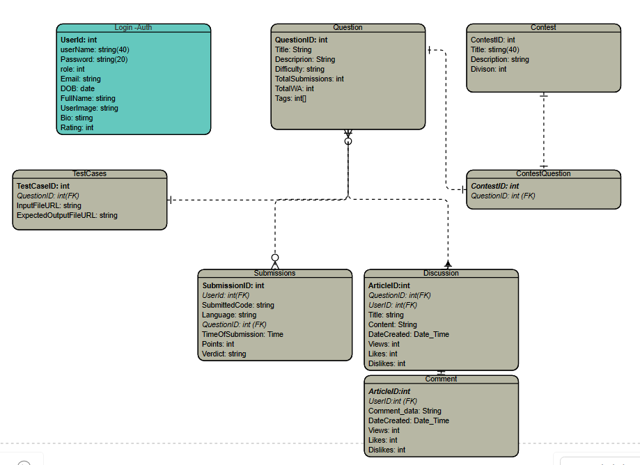
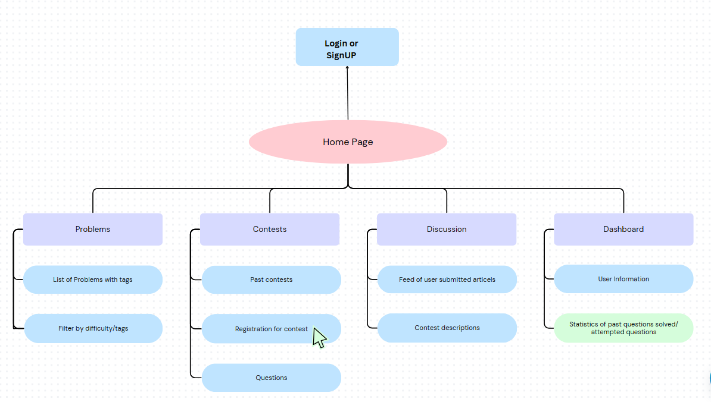

# High-Level Design Document for Online Judge Platform

## Table of Contents

- [High-Level Design Document for Online Judge Platform](#high-level-design-document-for-online-judge-platform)
  - [Table of Contents](#table-of-contents)
  - [Introduction](#introduction)
  - [Data Flow](#data-flow)
  - [HLD](#hld)
    - [Database designing](#database-designing)
  - [Entities and Relationships](#entities-and-relationships)
    - [User](#user)
    - [Question](#question)
    - [TestCase](#testcase)
    - [Submission](#submission)
    - [Discussion](#discussion)
    - [Comment](#comment)
    - [Contest](#contest)
    - [ContestQuestion](#contestquestion)
  - [Relationships](#relationships)
  - [UI and Routes](#ui-and-routes)
    - [Creating a Contest](#creating-a-contest)
    - [Participating in a Contest](#participating-in-a-contest)
    - [Discussing Solutions](#discussing-solutions)
  - [Technology Stack](#technology-stack)
  - [Component Description](#component-description)
    - [Frontend](#frontend)
    - [Backend](#backend)
    - [Database](#database)
    - [External Services](#external-services)
  - [Security](#security)
  - [Scalability and Performance](#scalability-and-performance)
  - [Conclusion](#conclusion)

## Introduction

The Online Judge Platform is designed to facilitate competitive programming and coding challenges. Users can submit their code, which will be evaluated against predefined test cases. The platform is built using the MERN stack (MongoDB, Express.js, React.js, Node.js).

## Data Flow

1. **User Registration/Login**:

   - User interacts with the frontend to register or log in.
   - Frontend sends a request to the backend.
   - Backend interacts with the database to store or validate user credentials.
   - Response is sent back to the frontend.

2. **Problem Retrieval**:

   - User requests a list of problems.
   - Frontend sends a request to the backend.
   - Backend retrieves problem data from the database.
   - Data is sent back to the frontend for display.

3. **Code Submission**:
   - User submits code via the frontend.
   - Code is sent to the backend.
   - Backend Runs the code in the Docker Container
   - Container runs the code and returns the results.
   - Result gets compared to the expected result.
   - Backend processes and stores the results, then sends them to the frontend.

## HLD

### Database designing

## Entities and Relationships

### User

- **\_id**: Primary Key, unique identifier for each user.
- **username**: User's name.
- **email**: User's email address.
- **passwordHash**: Hashed password for security.
- **registrationDate**: Date when the user registered.
- **DateOfBirth**: Date of birth.
- **FullName**: Full name of the user.
- **Bio**: About the User.
- **ProfilePicture**: S3 url for display picture.
- **Rating**: Rating of the user

### Question

- **\_id**: Primary Key, unique identifier for each question.
- **title**: Title of the question.
- **description**: Description of the question, including embedded image URLs.
- **difficulty**: Difficulty level of the question (e.g., easy, medium, hard).
- **Total submissons**: no of submissions
- **WA**: Total wrong no. of submissions
- **Tags**: List of Tags

### TestCase

- **TestCaseid**: Primary Key, unique identifier for each test case.
- **question_id**: Foreign Key, reference to the associated question.
- **inputFileURL**: URL to the input file stored in S3.
- **expectedOutputFileURL**: URL to the expected output file stored in S3.

### Submission

- **SubmissonID**: Primary Key, unique identifier for each submission.
- **user_id**: Foreign Key, reference to the user who made the submission.
- **question_id**: Foreign Key, reference to the question being answered.
- **Language**: Programming Language.
- **codeFileURL**: URL to the submitted code file stored in S3.
- **submissionTime**: Date and time of submission.
- **Verdict**: Result of the code execution (e.g., success, failure, error message).
- **Points**: Points scored

### Discussion

- **Article_id**: Primary Key, unique identifier for each discussion thread.
- **question_id**: Foreign Key, reference to the associated question.
- **user_id**: Foreign Key, reference to the user who initiated the discussion.
- **title**: Title of the discussion.
- **content**: Content of the discussion (e.g., description of the solution).
- **createdDate**: Date and time when the discussion was created.
- **Views**: Number of people who have viewed the article
- **Likes**: Likes in the article.
- **Dislikes**: DisLikes in the article.

### Comment

- **\_id**: Primary Key, unique identifier for each comment.
- **discussion_id**: Foreign Key, reference to the associated discussion.
- **user_id**: Foreign Key, reference to the user who wrote the comment.
- **content**: Content of the comment.
- **createdDate**: Date and time when the comment was created.
- **Views**: Number of people who have viewed the article
- **Likes**: Likes in the article.
- **Dislikes**: DisLikes in the article.

### Contest

- **\_id**: Primary Key, unique identifier for each contest.
- **Title**: Name of the contest.
- **startDate**: Start date and time of the contest.
- **endDate**: End date and time of the contest.
- **description**: Description of the contest.
- **Division**: Description of the contest.

### ContestQuestion

- **contest_id**: Foreign Key, reference to the associated contest.
- **question_id**: Foreign Key, reference to the associated question.

## Relationships

- **User to Submission**: A user can make multiple submissions. This is a one-to-many relationship.
- **Question to TestCase**: A question can have multiple test cases. This is a one-to-many relationship.
- **Question to Submission**: A question can receive multiple submissions from different users. This is a one-to-many relationship.
- **TestCase to Question**: Each test case belongs to one question. This is a many-to-one relationship.
- **Submission to User**: Each submission is made by one user. This is a many-to-one relationship.
- **Submission to Question**: Each submission is for one specific question. This is a many-to-one relationship.
- **Question to Tag**: A question can have multiple tags, and a tag can be associated with multiple questions. This is a many-to-many relationship facilitated by the `QuestionTag` join table.
- **Question to Discussion**: A question can have multiple discussions. This is a one-to-many relationship.
- **Discussion to Comment**: A discussion can have multiple comments. This is a one-to-many relationship.
- **User to Discussion**: A user can initiate multiple discussions. This is a one-to-many relationship.
- **User to Comment**: A user can write multiple comments. This is a one-to-many relationship.
- **Contest to ContestQuestion**: A contest can have multiple questions. This is a one-to-many relationship.
- **Question to ContestQuestion**: A question can be included in multiple contests. This is a many-to-many relationship facilitated by the `ContestQuestion` join table.
- **Contest to ContestQuestion**: A contest can receive multiple submissions. This is a one-to-many relationship.
- **User to ContestQuestion**: A user can submit multiple contest submissions. This is a one-to-many relationship.
- **Question to ContestQuestion**: A question can have multiple contest submissions. This is a one-to-many relationship.

## UI and Routes

### Creating a Contest

1. **Admin Interface**: Admin navigates to the contest creation page and fills out the form with contest details.
2. **Backend**: The form data is sent to the backend, which creates a new `Contest` entry in the database and associates selected questions using the `ContestQuestion` join table.
3. **Response**: The backend sends a response back to the admin interface confirming the creation of the contest.

### Participating in a Contest

1. **User Interface**: Users view active contests and select one to participate in.
2. **Contest Details**: The contest details and list of questions are fetched and displayed.
3. **Submitting Solutions**: Users select a question, write their solution, and submit it.
4. **Backend Processing**: The submission is sent to the backend, which stores the `ContestQuestion`, runs the code, and updates the result.
5. **Result Display**: The result of the submission is sent back to the user and displayed.

### Discussing Solutions

1. **User Interface**: Users can start a discussion for a question by filling out a discussion form.
2. **Backend**: The discussion is saved in the `Discussion` entity and linked to the respective question and user.
3. **Commenting**: Other users can view discussions and add comments, which are stored in the `Comment` entity.

## Technology Stack

- **Frontend**: React.js
- **Backend**: Node.js with Express.js
- **Database**: MongoDB
- **File Storage**: AWS S3 for storing code files, test cases, and images
- **External Services**: Code execution environment.

## Component Description

### Frontend

- **Technology**: React.js
- **Responsibilities**:
  - User authentication and authorization
  - Display coding problems and challenges
  - Code editor and submission interface
  - Display results and user rankings

### Backend

- **Technology**: Node.js with Express.js
- **Responsibilities**:
  - User management (registration, login, profiles)
  - Problem management (CRUD operations for problems and test cases)
  - Submission handling (receiving, storing, and forwarding code submissions to the execution service)
  - Result processing and storage

### Database

- **Technology**: MongoDB
- **Responsibilities**:
  - Store user data (credentials, profiles, history)
  - Store problems and test cases
  - Store submission data and results

### External Services

- **Code Execution Service**:
  - Sandbox environment for securely executing user-submitted code
  - Supports multiple programming languages
  - Returns execution results (output, errors, execution time, etc.)

## Security

- **Authentication and Authorization**:
  - Use JWT for securing API endpoints.
  - Role-based access control for different user levels (admin, user).
- **Data Protection**:
  - Use HTTPS for secure data transmission.
  - Encrypt sensitive data in the database.

## Scalability and Performance

- **Scalability**:
  - Use a load balancer to distribute traffic across multiple backend servers.
  - Implement horizontal scaling for the backend and database.
  - Using scheduling Queues for running submissions.
- **Performance**:
  - Optimize database queries and use indexing.
  - Implement caching strategies where appropriate.
  - Use a Content Delivery Network (CDN) for serving static assets.

## Conclusion

This high-level design document outlines the core components and architecture of the Online Judge Platform built using the MERN stack. It provides a foundation for further detailed design and implementation phases, ensuring a scalable, secure, and efficient system.
